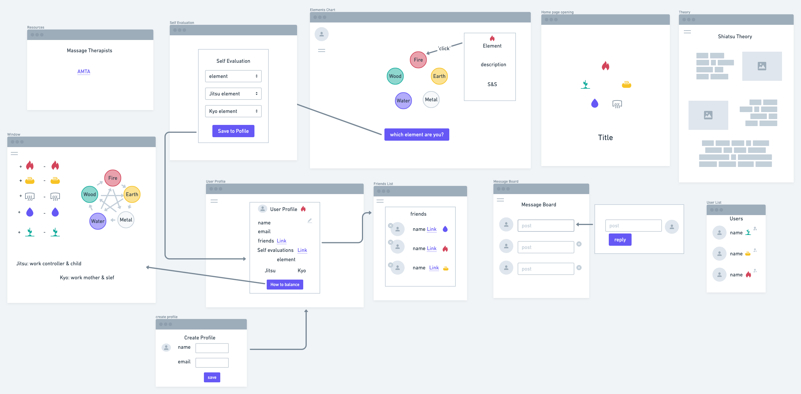
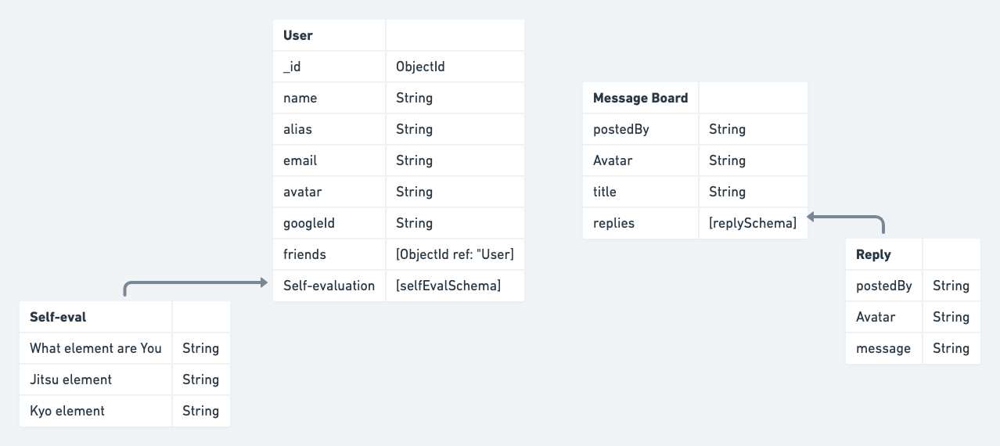

# Shiatsu App

This app is designed to educate and inform people about the eastern massage practice known as shiatsu. Learn the theory, and find the element you lean towards. Make a profile, add friends, and start a conversation on the message board. Figure out which elements are too Jitsu or Kyo, and find a treatment plan. Get linked up with a therapist from resources provided. 

## Technologies Used
* HTML
* CSS
* JS
* NODE.JS
* OAUTH
* PASSPORT
* MONGOOSE
* MONGODB

## Ice Box
1. Make image of body clickable for meridians 
2. individualized treatment plan for User
3. Save Jitsu and kyo elements to calender 
4. Add animation 

### Copyright 
