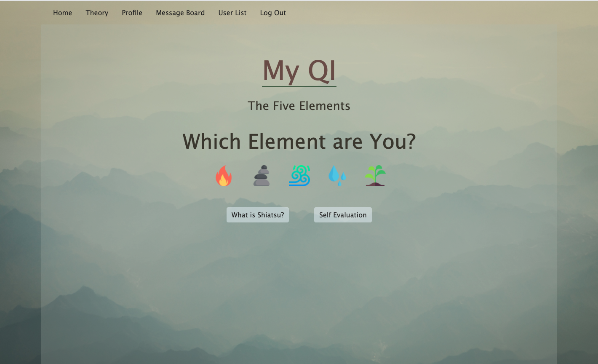
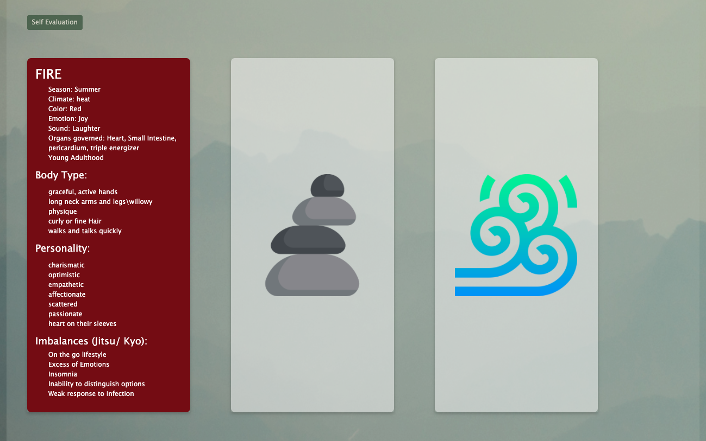
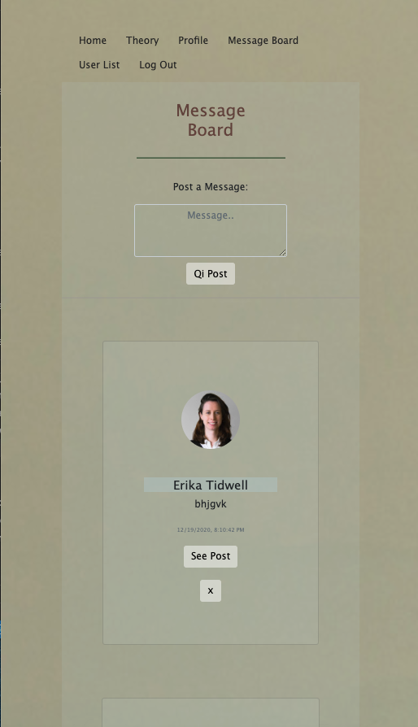

# My Qi App

This app is designed to educate and inform people about the eastern massage practice known as Shiatsu. Learn the theory, and find the element that speaks to you. Make a profile, add friends, and start a conversation on the message board. Figure out which elements you are too much(jitsu) of or too little(Kyo) of, and find a balance. Get linked up with a therapist from resources provided. 

<a href="https://shiatsu-app.herokuapp.com/">My Qi</a>  
<a href="https://trello.com/b/WHvLpju6/shiatsu-app">Trello Board</a>

## Setup
- Installed express-generator & ejs /method-override/mongoose/setup Mongodb database / Google OAuth/ opened in Node.js
- Made main user schema with a self evaluation schema embedded in it and user friends referenced. 
- Next I made a separate message schema with a replies schema embedded in it. 
- Setup all the routes in the server and connected them to the controller and models. 
- When the user is logged into google, they are able to make a profile page, update it, fill out a self evaluation form, and save it to their page. 
- The user can also view all the users and friend and remove friends. 
- The user can post on the message board and reply to other peoples posts. User can only delete their own post. 
- The user can go to a how to balance page, where they can find a link to the AMTA and get connected to a massage therapist. 
- I wrote up my view pages and how they all connected through the flow of the user experience. 
- I made the routes for those pages and handled the functionality for CRUD in the controller functions. 
- I styled the page to have a very zen feel, to keep with the feel of Shiatsu. 
  

## Technologies Used
* HTML
* CSS
* JS
* NODE.JS
* OAUTH
* PASSPORT
* MONGOOSE
* MONGODB
* VISUAL STUDIO CODE
* EXPRESS
* EJS
* HEROKU

## Ice Box
1. Make image of body clickable for meridians 
2. make all pages responsive
3. Save Jitsu and kyo elements to calender 
4. Add animation 

### Attributions

Disclaimer: The background picture is not my own. All credit goes to the author from [istock](https://www.istockphoto.com/stock-photos). This photo was bought and paid for. 

Error page - These videos are not my own and all credit goes to the authors of these videos. Videos are embedded from [YouTube](https://www.youtube.com/).
- [kiwi](https://www.youtube.com/watch?v=sdUUx5FdySs)
- [chess](https://www.youtube.com/watch?v=9IYRC7g2ICg&t=2s)
- [rocks](https://www.youtube.com/watch?v=HOPwXNFU7oU&t=4s)
- [heartbeat](https://www.youtube.com/watch?v=sAaqLIsOmCE&t=4s)

